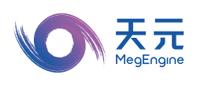

# MegEngine

<p align="center">
  
</p>

English | [中文](README_CN.md)

MegEngine is a fast, scalable and easy-to-use deep learning framework, with auto-differentiation.

------

## Installation

**NOTE:** MegEngine now supports Python installation on Linux-64bit/Windows-64bit/MacOS(CPU-Only)-10.14+ platforms with Python from 3.5 to 3.8. On Windows 10 you can either install the Linux distribution through [Windows Subsystem for Linux (WSL)](https://docs.microsoft.com/en-us/windows/wsl) or install the Windows distribution directly. Many other platforms are supported for inference.

### Binaries

To install the pre-built binaries via pip wheels:

```bash
python3 -m pip install --upgrade pip
python3 -m pip install megengine -f https://megengine.org.cn/whl/mge.html
```

## Building from Source

* CMake build details. please refer to [BUILD_README.md](scripts/cmake-build/BUILD_README.md)
* Python binding build details, Please refer to [BUILD_PYTHON_WHL_README.md](scripts/whl/BUILD_PYTHON_WHL_README.md)

## How to Contribute

* MegEngine adopts [Contributor Covenant](https://contributor-covenant.org) as a guideline to run our community. Please read the [Code of Conduct](CODE_OF_CONDUCT.md).
* Every contributor of MegEngine must sign a [Contributor License Agreement (CLA)](CONTRIBUTOR_LICENSE_AGREEMENT.md) to clarify the intellectual property license granted with the contributions.
* You can help to improve MegEngine in many ways:
    * Write code.
    * Improve [documentation](https://github.com/MegEngine/Docs).
    * Answer questions on [MegEngine Forum](https://discuss.megengine.org.cn), or Stack Overflow.
    * Contribute new models in [MegEngine Model Hub](https://github.com/megengine/hub).
    * Try a new idea on [MegStudio](https://studio.brainpp.com).
    * Report or investigate [bugs and issues](https://github.com/MegEngine/MegEngine/issues).
    * Review [Pull Requests](https://github.com/MegEngine/MegEngine/pulls).
    * Star MegEngine repo.
    * Cite MegEngine in your papers and articles.
    * Recommend MegEngine to your friends.
    * Any other form of contribution is welcomed.

We strive to build an open and friendly community. We aim to power humanity with AI.

## How to Contact Us

* Issue: [github.com/MegEngine/MegEngine/issues](https://github.com/MegEngine/MegEngine/issues)
* Email: [megengine-support@megvii.com](mailto:megengine-support@megvii.com)
* Forum: [discuss.megengine.org.cn](https://discuss.megengine.org.cn)
* QQ Group: 1029741705
* OPENI: [openi.org.cn/MegEngine](https://www.openi.org.cn/html/2020/Framework_0325/18.html)

## Resources

- [MegEngine](https://megengine.org.cn)
- [MegStudio](https://studio.brainpp.com)
- [Brain++](https://brainpp.megvii.com)

## License

MegEngine is licensed under the Apache License, Version 2.0

Copyright (c) 2014-2021 Megvii Inc. All rights reserved.
