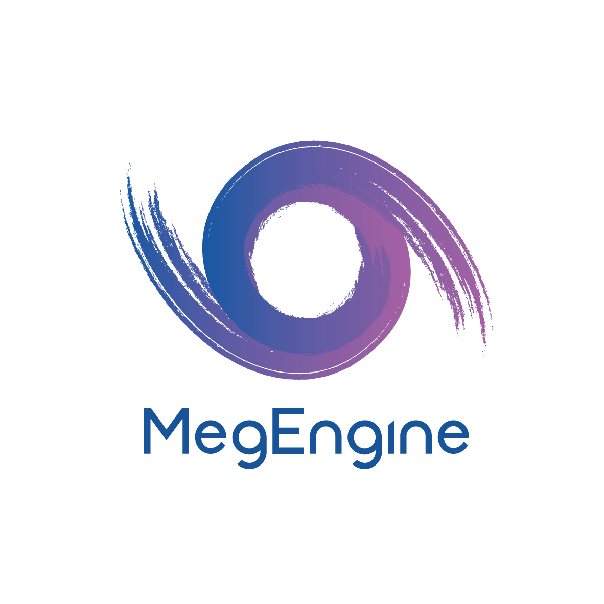

# MegEngine

<p align="center">
  
</p>

[English](README.md) | 中文

MegEngine 是一个快速、可拓展、易于使用且支持自动求导的深度学习框架。

------


## 安装说明

**注意:** MegEngine 现在支持 Linux-64bit/Windows-64bit/macos-10.14及其以上 (MacOS只支持cpu) 平台安装，支持Python3.5 到 Python3.8。对于 Windows 10 用户，可以通过安装 [Windows Subsystem for Linux (WSL)](https://docs.microsoft.com/en-us/windows/wsl) 进行体验，同时我们也原生支持Windows。

### 通过包管理器安装

通过 pip 安装的命令如下：

```bash
python3 -m pip install megengine -f https://megengine.org.cn/whl/mge.html
```

## 通过源码编译安装

### 环境依赖

大多数编译 MegEngine 的依赖位于 `third_party` 目录，可以通过以下命令自动安装：

```bash
$ ./third_party/prepare.sh
$ ./third_party/install-mkl.sh
```

但是有一些依赖需要手动安装：

* [CUDA](https://developer.nvidia.com/cuda-toolkit-archive)(>=10.1), [cuDNN](https://developer.nvidia.com/cudnn)(>=7.6) ，如果需要编译支持 CUDA 的版本。
* [TensorRT](https://docs.nvidia.com/deeplearning/sdk/tensorrt-archived/index.html)(>=5.1.5) ，如果需要编译支持 TensorRT 的版本。
* LLVM/Clang(>=6.0) ，如果需要编译支持 Halide JIT 的版本（默认开启）。
* Python(>=3.5), Numpy, SWIG(>=3.0) ，如果需要编译生成 Python 模块。

### 开始编译

MegEngine使用CMake作为构建工具。我们提供以下脚本来帮助编译:

* [host_build.sh](scripts/cmake-build/host_build.sh) 用于本地编译。
参数 -h 可用于查询脚本支持的参数:
  
  ```
  scripts/cmake-build/host_build.sh -h
  ```
* [cross_build_android_arm_inference.sh](scripts/cmake-build/cross_build_android_arm_inference.sh) 用于ARM-安卓交叉编译。
参数 -h 可用于查询脚本支持的参数:
  
  ```
  scripts/cmake-build/cross_build_android_arm_inference.sh -h
  ```
* [cross_build_linux_arm_inference.sh](scripts/cmake-build/cross_build_linux_arm_inference.sh) 用于ARM-Linux交叉编译。
参数 -h 可用于查询脚本支持的参数:
  
  ```
  scripts/cmake-build/cross_build_linux_arm_inference.sh -h
  ```
* [cross_build_ios_arm_inference.sh](scripts/cmake-build/cross_build_ios_arm_inference.sh) 用于IOS交叉编译。
  参数 -h 可用于查询脚本支持的参数:

  ```
  scripts/cmake-build/cross_build_ios_arm_inference.sh
  ```
  更多细节请参考 [BUILD_README.md](scripts/cmake-build/BUILD_README.md)


## 如何参与贡献

* MegEngine 依据 [贡献者公约（Contributor Covenant）](https://contributor-covenant.org)来管理开源社区。请阅读 [行为准则](CODE_OF_CONDUCT.md) 了解更多信息。
* 每一名 MegEngine 的贡献者都需要签署贡献者许可协议（Contributor License Agreement，CLA）来明确贡献内容相关的知识产权许可。更多细节请参考 [协议内容](CONTRIBUTOR_LICENSE_AGREEMENT.md)。
* 我们欢迎你通过以下方式来帮助 MegEngine 变得更好：
    * 贡献代码；
    * 完善[文档](https://github.com/MegEngine/Docs)；
    * 在 [MegEngine 论坛](https://discuss.megengine.org.cn) 和 Stack Overflow 回答问题；
    * 在 [MegEngine Model Hub](https://github.com/megengine/hub) 贡献新模型；
    * 在 [MegStudio](https://studio.brainpp.com) 平台尝试新想法；
    * 报告使用中的 [Bugs 和 Issues](https://github.com/MegEngine/MegEngine/issues)；
    * 审查 [Pull Requests](https://github.com/MegEngine/MegEngine/pulls)；
    * 给 MegEngine 点亮小星星；
    * 在你的论文和文章中引用 MegEngine；
    * 向你的好友推荐 MegEngine；
    * ...

我们相信我们能够搭建一个开放友善的开源社区环境，用人工智能造福人类。

## 联系我们

* 问题: [github.com/MegEngine/MegEngine/issues](https://github.com/MegEngine/MegEngine/issues)
* 邮箱: [megengine-support@megvii.com](mailto:megengine-support@megvii.com)
* 论坛: [discuss.megengine.org.cn](https://discuss.megengine.org.cn)
* QQ: 1029741705
* OPENI: [openi.org.cn/MegEngine](https://www.openi.org.cn/html/2020/Framework_0325/18.html) 

## 资源

- [MegEngine](https://megengine.org.cn)
- [MegStudio](https://studio.brainpp.com)
- [Brain++](https://brainpp.megvii.com)

## 开源许可

MegEngine 使用 Apache License, Version 2.0

Copyright (c) 2014-2020 Megvii Inc. All rights reserved.
